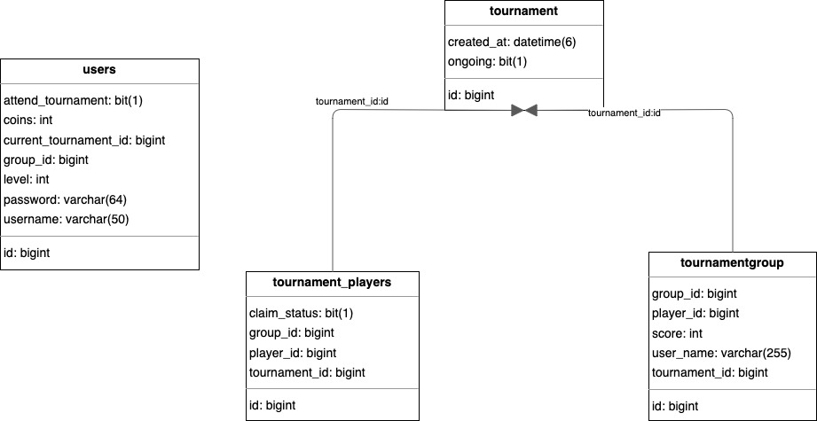

## Spring Boot Game Api Case Study

Short design documentation and class diagram is in docs folder.

My brief detail for my implementations can be read in application servide folder
as javadoc commets.




run this command in the command line in project root directory:
```
mvn spring-boot:run
```
